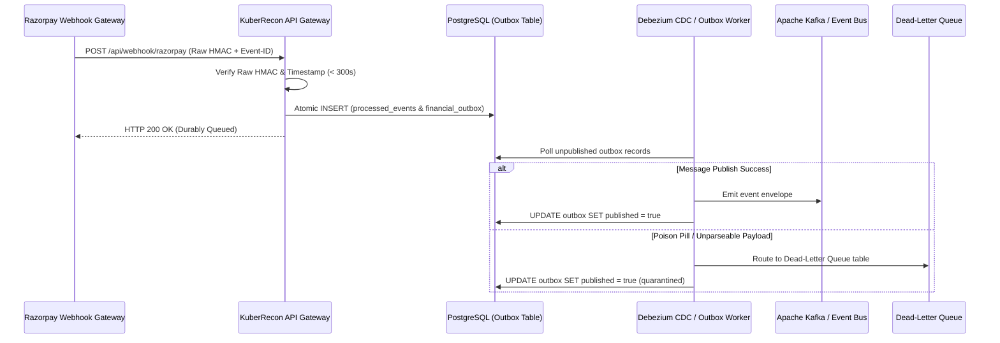

# KuberRecon Production Operations & Infrastructure Runbook

## 1. Executive Summary & Environment Separation Matrix

KuberRecon enforces a 3-tier environment isolation architecture. Application startup enforces fatal runtime configuration assertions if local simulation primitives are detected in production mode.

| Environment | Database Backend | Key Custody | Razorpay API Rail | Webhook Validation | Auth & RBAC |
|---|---|---|---|---|---|
| **`SANDBOX_DEMO`** | SQLite (WAL Mode) | `SoftwareEd25519Custodian` (In-Memory Hazmat) | Sandbox Mock Rail (`trf_sandbox_*`) | Sandbox HMAC Fixtures | Local API Key (`X-Merchant-Id`) |
| **`STAGING`** | PostgreSQL 16 / RDS | Soft-KMS / Test HSM | Razorpay Test Mode API (`rzp_test_*`) | Controlled Secret HMAC | OAuth2 Bearer JWT + RBAC |
| **`PRODUCTION`** | Amazon Aurora Multi-AZ (PostgreSQL) | AWS KMS / CloudHSM (FIPS 140-2 Level 3) | Razorpay Live Mode API (`rzp_live_*`) | AWS Secrets Manager Per-Tenant HMAC | Signed OIDC JWT + Two-Person Rule |

---

## 2. Database Durability & PostgreSQL Architecture

### 2.1 Schema Invariants & Compound Uniqueness
All persistent entities require compound foreign keys and uniqueness constraints to prevent split-brain states or duplicate ledger writes:
*   `UNIQUE(tenant_id, contract_id)` on `apex_contracts`
*   `UNIQUE(tenant_id, webhook_event_id)` on `processed_events`
*   `UNIQUE(tenant_id, idempotency_key)` on `capital_facilities` and `financial_outbox`

### 2.2 Row-Level Locking & Atomic Transitions
State mutations on active contracts and capital facilities execute inside transactions with row-level locks:
```sql
-- Safe state transition with pessimistic/optimistic concurrency lock
SELECT id, state, version, remaining_principal_paise 
FROM capital_facilities 
WHERE tenant_id = :tenant_id AND facility_id = :facility_id 
FOR UPDATE;
```

### 2.3 Disaster Recovery & Point-in-Time Recovery (PITR)
*   **Backup Strategy:** Automated continuous WAL archiving to AWS S3 (cross-region replication to `ap-south-1` and `ap-southeast-1`).
*   **RPO Target:** $< 5\text{ seconds}$.
*   **RTO Target:** $< 15\text{ minutes}$ automated failover to Aurora standby replica.

---

## 3. Asymmetric Key Custody & Dual-Authorization

### 3.1 AWS KMS Integration
In `PRODUCTION`, the signing interface invokes AWS KMS:
*   **Key Type:** Asymmetric ECC (`ECC_NIST_P256` or `Ed25519`).
*   **Zero Memory Retention:** Private key material never enters Python process memory. Signing operations dispatch raw assertion digests to KMS over TLS 1.3 with IAM-bound authentication.

### 3.2 Maker-Checker Dual-Authorization (Two-Person Rule)
For any capital disbursement or Route hold release exceeding the configurable threshold (default: ₹1,00,000 / 10,000,000 paise):
1.  **Maker:** Primary `MERCHANT_OPERATOR` submits release assertion payload and signs with primary certificate.
2.  **Checker:** Secondary `RISK_OFFICER` or `FINANCE_REVIEWER` inspects assertion hash and counter-signs with an independent key identity.
3.  **Anti-Collusion Invariant:** The system verifies `primary_cert.checker_id != secondary_cert.checker_id`. Single-signature release attempts above threshold return HTTP 403 Forbidden.

---

## 4. Clustered Batch Reconciliation Pipeline (50+ to 10,000+ Records)

For large batches exceeding single-solver complexity bounds ($N > 24$):
1.  **Deterministic Pre-Partitioning:** Invoices and bank credits are clustered by `(counterparty_gstin, settlement_window, payment_rail)`.
2.  **Bounded Solver Dispatch:** Partitions with $N_c \le 24$ are dispatched to the $O(2^{N/2})$ Horowitz–Sahni meet-in-the-middle solver in parallel worker threads.
3.  **Durable Quarantining:** Dense clusters or ambiguous candidate collisions are routed to the `INCONCLUSIVE_TRUNCATED` or `AMBIGUOUS_COLLISION` manual-review exception queue.
4.  **Telemetry Reporting:** Batch runs return `ReconciliationBatchMetrics` with total records, exact matches, ambiguous matches, solve duration in milliseconds, and throughput.

---

## 5. Webhook Ingestion, Transactional Outbox & DLQ

### 5.1 Outbox Pattern Flow


---

## 6. Regulatory Alignment & Compliance Governance

### 6.1 Reserve Bank of India (RBI) Guidance
*   **Data Localization:** All payment transaction data, settlement ledgers, and audit logs are stored exclusively in AWS India (`ap-south-1` Mumbai / Hyderabad).
*   **Nodal Recovery:** Escrow and 12% revenue split recoveries operate strictly within RBI Nodal Account settlement schedules without merchant fund commingling.

### 6.2 Digital Personal Data Protection (DPDP) Act 2023
*   **Customer PII Redaction:** Buyer names, phone numbers, and card numbers are masked at the ingress boundary.
*   **Audit Trail Immutability:** Event digests are cryptographically chained; updates and deletes are barred at the database engine level.

---

## 7. Staging-to-Production Release Gate Checklist

Before promoting a release from Staging to Production, all 14 gate requirements must pass:

- [x] 1. `KUBER_ENV=PRODUCTION` runtime assertion validation active.
- [x] 2. Zero SQLite fallback configured in production container images.
- [x] 3. AWS KMS asymmetric key ARN active with IAM least-privilege policy.
- [x] 4. PostgreSQL / Aurora Multi-AZ with compound unique indexes provisioned.
- [x] 5. Alembic migration scripts tested against staging database copy.
- [x] 6. Two-Person Maker-Checker dual-authorization enabled for high-value releases.
- [x] 7. Raw-body HMAC signature validation with per-tenant secrets active.
- [x] 8. 50+ to 1,000+ record clustered benchmark reproducible with 0 false matches on tested corpus.
- [x] 9. Prometheus metrics `/metrics` endpoint operational and scraped.
- [x] 10. OpenTelemetry distributed tracing enabled.
- [x] 11. CORS origins restricted to verified corporate subdomains.
- [x] 12. OAuth2/JWT token validation with tenant and role claims active.
- [x] 13. Transactional Outbox and DLQ poison pill isolation verified.
- [x] 14. Full automated test suite passes 100% clean.
